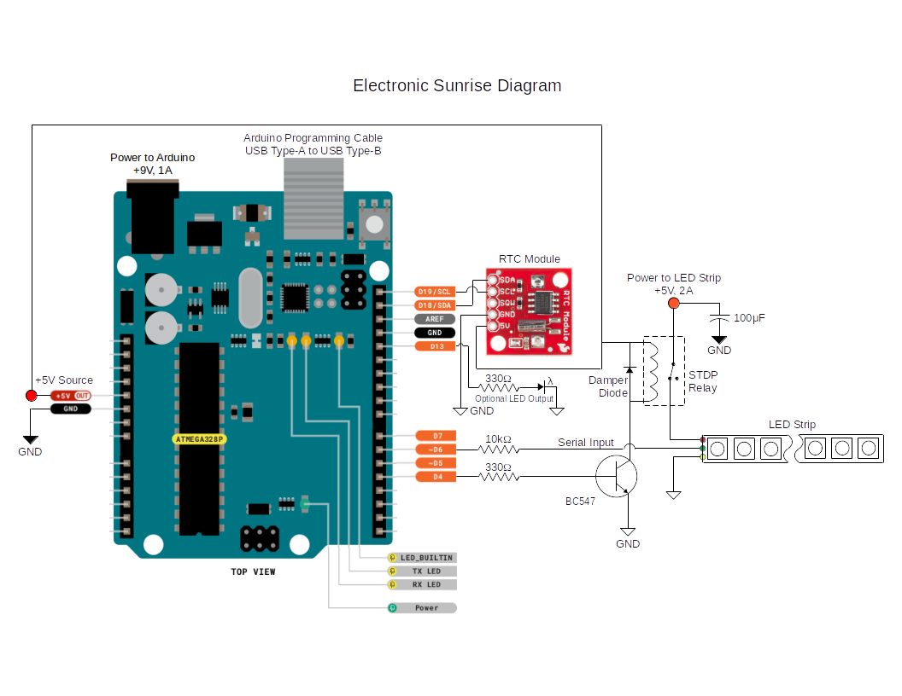
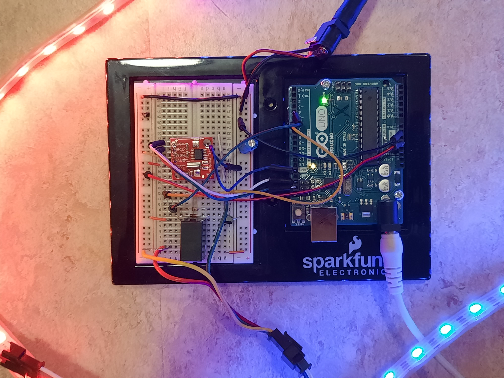
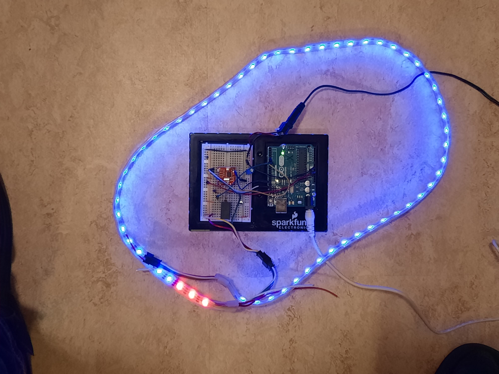
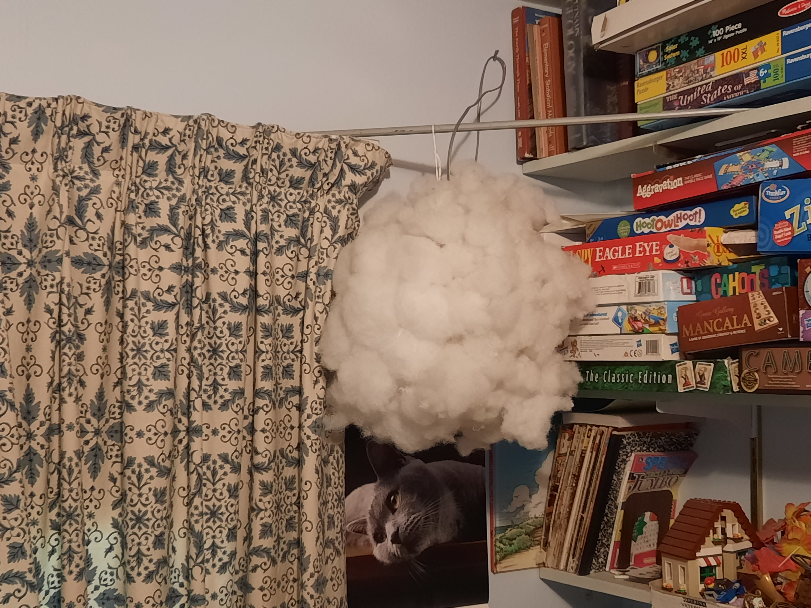
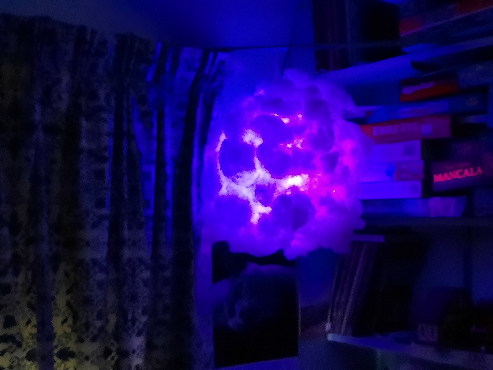
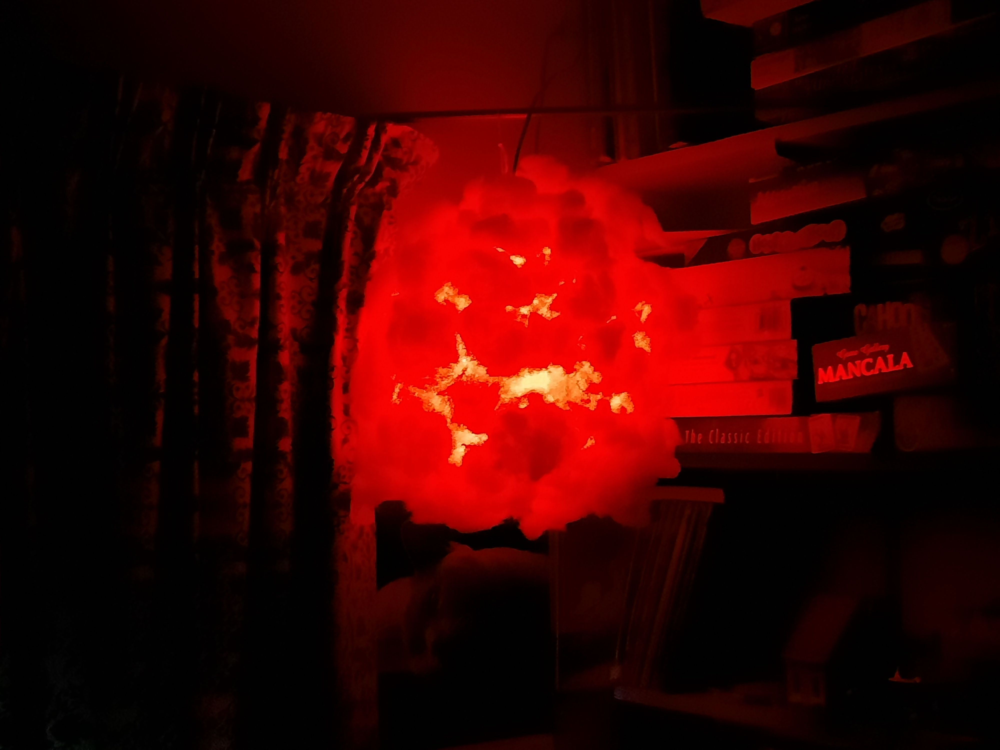
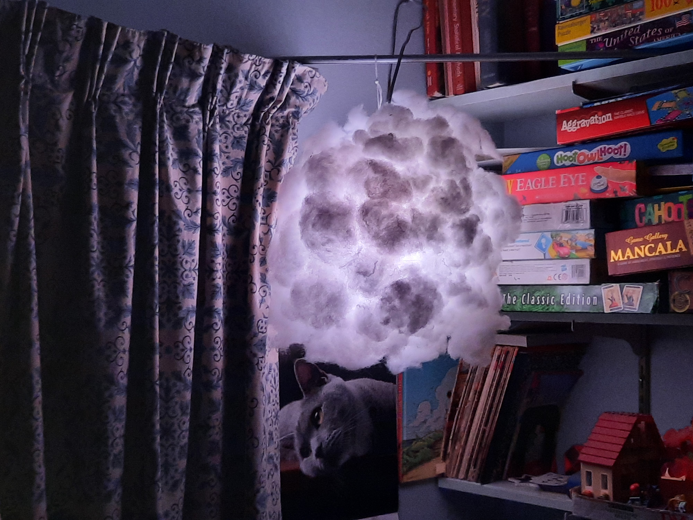
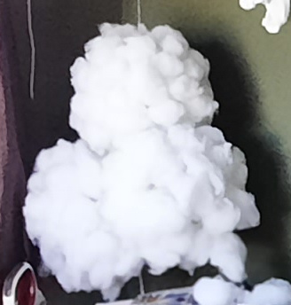

# electronic-sunrise
Arduino project using a LED light-strip to simulate a sunrise to wake up to. 

### Description of Device
This project uses an Arduino micro-controller to time a gradual light-strip illumination to simulate a sunrise, and thus allow one to wake up gradually rather than suddenly by an alarm clock. 

I've noticed while camping that I could awake gradually and happily by the sunrise, even though the time of day was much earlier than when I usually wake up at home. Most mammals, humans included, and other fauna and flora use sunlight to wake up to, unless nocturnal. The use of an audio alarm clock to wake up from in the morning is using a state-of-danger method that is not natural on a continuing basis. 

This project shows you how to build a light-awakening device that simulates the sunrise. 

### Hardware & Circuit Description
I used an **Arduino Uno** micro-controller to control the timing of the unit; a light-emitting-diode (LED) light-strip; a Real Time Clock (RTC) module for accurate time-keeping; a NPN junction transistor; a 5 Volt relay; and some supporting components such as two power supplies, resistors, a diode, a capacitor, and connecting cables. 

I powered the **Arduino Uno** by a 9 Volt power supply with 1 Ampere current capacity, and the light-strip with its own 5 Volt power supply with a 2 Amp capability, as seen in Figures 1, 2, and 3. 

                    Fig. 1. Schematic diagram of electronic sunrise circuit.

Although the Arduino micro-processor has a clock, I'm using an external precision clock with its own button battery, the **Real Time Clock Module**, available from **Sparkfun** (see https://www.sparkfun.com/sparkfun-real-time-clock-module.html). The module uses a DS1307 I2C (Inter-Integrated Circuit) for timing. The Arduino Uno and RTC module data line (SDL) and clock line (SCL) are connected to each other. The regulated 5 Volt output from the Arduino Uno powers the RTC module, although the module's button battery will keep time for years, theoretically. 

The Arduino digital-output pin 6 controls the LED light-strip through a 10k&Omega; resistor as a buffer, and an extra power supply of 5 Volts powers the light-strip; I added the extra power supply so that the 9 Volt power supply that powers everything else would not be overburdened. A 100&micro;F capacitor filters spikes across this power into the light-strip. 

I found that occasionally the light-strip would remain latched to an on-state, even when the circuit was in the off-state. To remedy this I added the transistor and relay circuit to cut the power to the light-strip when the system is in the off-state. Referring to Figure 1, Digital-output pin 4 controls the junction transistor that turns the relay on when the light-strip should be on. The transistor is a BC547, but a conventional NPN junction transistor such as a 2N2222 will work as a current switch. 

The 330&Omega; resistor buffers the digital-output to turn the NPN transistor on, which then turns the relay on that controls the light-strip power. During the off phase the transistor is turned off, and the dampening diode shunts the relay, allowing its coil's current to continue to flow after the transistor current switch is turned off, otherwise a large reverse bucking voltage across the coil might damage adjoining components. 

For another electronic sunrise circuit I used a MOSFET (metal-oxide semiconductor field-effect transistor) as a voltage switch to control the power to the relay and thus the light-strip. In that case I shunted the gate to ground with a large ~100 k&Omega; resistor to bleed the voltage off when the gate signal is off. 

I'm using a small SPDT (single-pole double-throw) sealed relay, such as available from **Sparkfun** (https://www.sparkfun.com/relay-spdt-sealed.html) or from **Jameco** (https://www.jameco.com/z/G5V-1-DC5-Omron-Low-Signal-Miniature-Relay-SPDT-1A-5-Volt-Through-Hole_187240.html). 

I put the electronic circuitry on a 3.29 x 2.15 x 0.33" breadboard, that allows components to be inserted without soldering (see https://www.sparkfun.com/breadboard-self-adhesive-white.html). This breadboard is combined with the Arduino breadboard holder (see https://www.sparkfun.com/arduino-and-breadboard-holder.html), so that both circuit boards can reside together. See Figure 2 for the layout.  

                    Fig. 2. Closeup of circuit boards.

The light-strip is a sealed addressable 1 meter long 5V RGB LED strip that contains 60 light-emitting-diodes. This, or a similar one is available at Sparkfun, URL is www.sparkfun.com/led-rgb-strip-addressable-sealed-1m-apa104.html. 

The LED light-strip has a female pigtail connector that plugs into a male pigtail connector, used on the proto-board. I've purchased a few of these pig-tail connector pairs so that I can insert a long 3-conductor cable between the proto-board and the light-strip. I am then able to directly connect the light-strip into the proto-board without the intervening cable for testing. I either solder or connect the pig-tail connector-pairs with wire-nuts to both ends of the connecting cable. The LED-strip 3-pin pigtail connectors are also available at Sparkfun Electronics, c.f., https://www.sparkfun.com/led-strip-pigtail-connector-3-pin.html. Figure 3 shows the light-strip directly connected to the proto-board circuit. 

	Fig. 3. Circuit boards showing light-strip transitioning from blue to red. 

I put the light-strip into a one foot diameter paper lantern, with polyfill glued onto the outside of the ball to diffuse the light, as described at https://learn.sparkfun.com/tutorials/led-cloud-connected-cloud/all. I used contact cement for the adhesive between the fill and the lantern; I found rubber cement insufficiently durable, with fill pieces falling off too frequently. Figure 4 shows an unlit cloud, and Figures 5, 6, and 7 show the lit cloud for some of the lighting sequences. 

                    	Fig. 4. Unlit cloud. 

                    Fig. 5. Blue-phase cloud. 

                    Fig. 6. Red-phase cloud. 

                    Fig. 7. Final white-phase cloud. 

I've made a five meter electronic sunrise, with 300 LEDs using a similar circuit, as shown in Figure 8.

                    Fig. 8. 4-ball cloud, with 300 LEDs.

### Software
The unit is programmed by the **Arduino IDE** (Integrated Development Environment) program, freely available for installation on most computers. 

#### Definitions and Setup
Referring to the **electronic_sunrise-60_led.ino** file, the Arduino C++ code that runs the unit, included are a Real Time Clock (RTC) Module header-file and C++ file, and a Adafruit LED light-strip header-file and C++ file: 

    SparkFunDS1307RTC.h
    SparkFunDS1307RTC.cpp
    Adafruit_NeoPixel.h
    Adafruit_NeoPixel.cpp

Next, output pins are defined, such as the digital-output light-strip pin 6 for the relay circuit, and digital-output pin 13 for an external LED if desired to indicate the unit is in the **On** state. 

The abbreviated names of the week, e.g, Sun, ..., Sat, are defined from 1 to 7 for easier code interpretation. Also, the three types of work-days are defined as integers: a normal workday; a late-start workday, and a weekend: 

    #define workday 1
    #define lateStart 2
    #define weekend 3

The light-strip is initialized by the line, 

    Adafruit_NeoPixel strip_a = Adafruit_NeoPixel(300, PINA, NEO_GRB + NEO_KHZ800);

The delay time **led_delay** is the period in milliseconds between each individual LED activation, and the delay time, **strip_delay**, is the period in milliseconds between color sequences, i.e., blue, red, orange, etc. **num_led** is set to the number of LEDs in the strip. 

In the setup phase, the Arduino builtin LED is assigned as an output, and the external LED is assigned and set to low:

  pinMode(LED_BUILTIN, OUTPUT);

  pinMode(ON_CYCLE_PIN, OUTPUT);
  digitalWrite(ON_CYCLE_PIN, LOW);

Also defined is the pin controlling the SPDT relay, pin 4: 

  pinMode(relayPin, OUTPUT);

The serial monitor that allows one to view the time and date output is set:

  Serial.begin(9600);

The real time clock module is initialized: 

  rtc.begin();

The RTC module's time can be set by the command:

  rtc.autoTime();

which sets the time to the computer's system, or by setting the time manually, e.g. 7:32:16 | Monday October 31, 2021, becomes:

    rtc.setTime(16, 32, 7, 2, 31, 10, 21);

And setting it to a 12-hour mode for AM and PM if desired: 

  rtc.set12Hour();

The RTC module is then initialized, as well as the light-strip. 

#### Main Loop
Once the header files are included, the definitions assigned, and the setup finished, the main loop begins, and perpetuates until some cessation of operation. 

Variables declared as *static* are ones that become persistent in the scope of the current routine. Several of such static variables are thus declared that keep track of times and dates, and other operations. **currentMinute**, **currentHour**, and **currentDay** keep corresponding track of the minute, hour, and day. Comparing them to set times to determine when the light alarm turns on. 

The on-off cycle boolean flag, **flgOnCycle**, is set to **false** when the light-strip is off, and **true** when the light-strip is on. 

There are four types of alarms when the light-strip is activated: **workday**, the typical workday morning, here set at 7:00 AM; **lateStart**, a "late-start" morning, here set at 8:00 AM; **weekend**, a weekend alarm that might be set later in the morning, here set at 9:00 AM; and finally a test alarm that activates the light-strip in the evening for inspection in case the device is not working. 

The duration of the light-strip once it is passed through all the lighted phases can be set by **durationCounter**, which is initially set to the value **durationMinutes**, and is decremented each time by a minute until null, thus setting **flgOnCycle** to **false**. 

A late-start day, a day that one that might start out an hour later or earlier, or example, is set by setting **mon_late**, **tue_late**, **wed_late**, **thu_late**, or **fri_late** to **true**. 

**day_status** is declared static, and will be set to one of the work-day types: workday (1), lateStart (2), or weekend (3). 

The code then checks for any change of time, beginning with minute, i.e., if **rtc.minute** has updated to a different time than **currentMinute**, then **currentMinute** is updated, and then the hour, **rtc.hour** is checked if different from **currentHour**, and then the day is checked for a change. If the day has changed, the type of day is determined, i.e., whether it's a workday or a late-start day. If the day is not either of these day-types, the day is considered a weekend day. 

While either the system is off or on, the date and time is serially output every five minutes. When the system is off:

    if (flgOnCycle == false) {
      if (currentMinute % 5 == 0) {
        Serial.print("Off: ");
        printTime(); // Print the new time.
      }
      ...

or when it is on: 

    }
    else { 
      if (rtc.getMinute() % 5 == 0) {
        Serial.print("On: ");
        printTime(); // Print the new time.
      }

With the **day_status** state determined, it, along with the corresponding time interval in minutes is compared to the current time in minutes and the on- or off-state is determined. If the on-state results, the built-in and on-cycle LEDs along with the relay output are activated, turning the alarm state to on. **flgOnCycle** is set to **true**, and the **sunRise** function is accessed to turn on the LED lighting sequence. 

Once the **sunRise** function has completed, the **durationCounter** is set to the value of **durationMinutes**, and the  **durationCounter** variable is decremented every minute the system is on. When **durationCounter** is null, the system turns off: the relay is turned off, the on-indicator LEDs turn off, and **flgOnCycle** is set to **false**. The cloud containing the LED light-strip is turned off by accessing the function **clearCloud()**.

#### Sunrise Functions
The **sunRise** function activates the LED color sequences: blue, red, orange, yellow, and finally white. Each light-strip LED is turned on for the duration of the delay **led_delay**, here set for 6000 milliseconds. Once all the LEDs of a sequence are lit, the next color phase begins. 

The blue phase represents the early morning with increasing blueness before the sunrise. Red represents the sunrise, with orange and yellow phases as the sun rises higher. Finally, white represents the risen sun, and this phase continues until **durationCounter** decrements from value of **durationMinutes** (here set to 45 minutes) to null. 

The **clearCloud** function turns the light-strip to off. 

#### Print Function
The **printTime** function prints the time as hour:minute:second along with the date as the day: Sunday through Saturday, and month/day/year, e.g., 5/19/25. 

### Addendum
The variables can be set to other values, such as the times of day the alarm comes on, and the duration of the lighting phases. Also the types of lighting colors can be set to imitate other types of sunrises or whatever the designer has in mind. 
